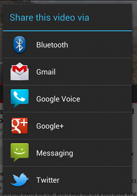

Android开发备忘
--------

Android List View tutorials : http://www.vogella.com/tutorials/AndroidListView/article.html


# Intent 

## 显式和隐式intent    

`显式的intent`: 就是在intent里显式地指定要启动的Activity或Service的fully-qualified类名.
``` java
Intent content = new Intent(mContext, EmptyActivity.class);
```

`隐式intent`: 不明确地指定要启动的Activity或Service的fully-qualified类名，由系统来决定启动哪个Activity或Service。比如我们要分享一个视频，我们要使用action为 ACTION_SEND的intent，你的系统里可能有多个应用能影响这个intent。       
    

下面的代码显示一个选择对话框给用户，让用户决定用哪个app来分享视频。

```java
Intent sendIntent = new Intent(Intent.ACTION_SEND);
...

// Always use string resources for UI text.
// This says something like "Share this photo with"
String title = getResources().getString(R.string.chooser_title);
// Create intent to show the chooser dialog
Intent chooser = Intent.createChooser(sendIntent, title);

// Verify the original intent will resolve to at least one activity
if (sendIntent.resolveActivity(getPackageManager()) != null) {
    startActivity(chooser);
}
```

## intent-filter
如果我们的Activity想要接受，或者说是响应上例中的隐式intent，我们要怎么做？那就需要在我们app的AndroidMenifest.xml里声明Activity时使用intent-filter。intent filter根据它的action、data和category等属性来确定它能响应的intent。系统会把通过（匹配）了intent filter的intent传给你的应用。


我们来详细了解一下intent filter的属性。

### action
intent的「动作」名，指明intent想要执行的动作，比如分享信息使用"android.intent.action.SEND"。


### category
官方的文档上说是为将要执行的activity提供一些额外的信息。举两个例子来说明一下：    
* CATEGORY_LAUNCHER(android.intent.category.LAUNCHER)     
这是一个最常用的category，activity会显示在应用启动器（the system's application launcher）的列表里。  
```xml
<activity android:name=".MainActivity" android:label="@string/title_activity_main" >
    <intent-filter>
        <action android:name="android.intent.action.MAIN" />
        <category android:name="android.intent.category.LAUNCHER" />
    </intent-filter>
</activity>
```

* CATEGORY_BROWSABLE("android.intent.category.BROWSABLE")    
activity将可以通过web浏览器来启动，比如你写的是个email的客户端,页面里有个mailto:someone@xxx.com的link，你希望你的activity在用户点击了这个link时启动，你就要为你的activity加上这个category。可能的写法是：
```xml
<activity android:name=".ComposeEmailActivity" android:label="@string/title_activity_compose_email" >
    <intent-filter>
        <action android:name="android.intent.action.MAIN" />
        <category android:name="android.intent.category.LAUNCHER" />
    </intent-filter>
    <intent-filter>
        <action android:name="android.intent.action.VIEW" />
        <category android:name="android.intent.category.DEFAULT" />
        <category android:name="android.intent.category.BROWSABLE" />
        <data android:scheme="mailto"/>
    </intent-filter>
</activity>
```

* CATEGORY_DEFAULT("android.intent.category.DEFAULT")
如果你的activity要接收隐式intent，你就必须在intent-filter里包含这个category.这是系统把隐式intent传递到你的activity的必要条件。
```xml
<activity android:name="ShareActivity">
    <intent-filter>
        <action android:name="android.intent.action.SEND"/>
        <category android:name="android.intent.category.DEFAULT"/>
        <data android:mimeType="text/plain"/>
    </intent-filter>
</activity>
```

Todo:再分析一下category的其它属性。


请参考：   

http://developer.android.com/reference/android/content/Intent.html

http://developer.android.com/guide/components/intents-filters.html

国内讲得比较详细的文章：      
[Android Intent Action 大全](http://blog.csdn.net/ithomer/article/details/8242471)

# android twitter intergration.

http://hintdesk.com/how-to-tweet-in-twitter-within-android-client/

```xml
<activity android:name=".MainActivity" android:label="@string/title_activity_main" >
    <intent-filter>
        <action android:name="android.intent.action.MAIN" />
        <category android:name="android.intent.category.LAUNCHER" />
    </intent-filter>
    <intent-filter>
        <action android:name="android.intent.action.VIEW" />
        <category android:name="android.intent.category.DEFAULT" />
        <category android:name="android.intent.category.BROWSABLE" />
        <data android:scheme="oauth" android:host="t4jsample"/>
    </intent-filter>
</activity>
```
