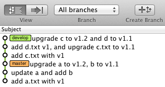
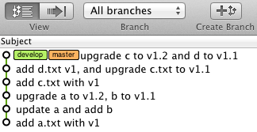
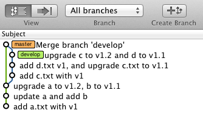

git备忘
----------


# 1 git config
```
$ git config --global user.name "John Doe"
$ git config --global user.email johndoe@example.com
$ git config --global core.editor emacs
$ git config --global core.askpass /usr/bin/ksshaskpass

$ git config --global http.sslverify false
```


如果自签名的证书在Jenkins下有问题，请添加一个构建参数： GIT_SSL_NO_VERIFY  true

# 2 git的特点
Conceptually, most other systems store information as a list of file-based changes.
其它的vcs都是保存的是基于文件的变更(file-based changes) ,而git保存的是快照(snapshot)

Every time you commit, or save the state of your project in Git, it basically takes a picture of what all your files look like at that moment and stores a reference to that snapshot. To be efficient, if files have not changed, Git doesn't store the file again—just a link to the previous identical file it has already stored.

每次你提交或是在git里保存你的项目的状态，它会创建一个当前项目所有文件的快照，同时保存一个指向这个快照的引用。为了使这个过程更快，如果一个文件没有发生变化（本次提交没有修改），那git不会再保存一份这个文件，而是保存一个指向上一个变化了版本链接。


Git never allows you to push changes to the remote if there have been remote changes.

git是分布式的scm，分布式体现在哪儿呢？
如果你git clone一个repository,那么，你就有了一个local repository,你在本地所做所有的修改都会被记录到local repository里。
先说说这个local repository吧。 git的local repository是 full function的，跟svn和cvs不一样的是，local repository通常是跟工作目录在一起的。
也就是工作目录就是一个repository!

```
$ git remote    
origin   #这里的origin是一个短名，shortname
$ git remote add pb git://github.com/paulboone/ticgit.git
$ git remote -v
origin git://github.com/schacon/ticgit.git
pb git://github.com/paulboone/ticgit.git
```
如果你想查看remote更详细的信息。
```
$ git remote show origin  
*remote origin   
  URL: git://github.com/schacon/ticgit.git  
  Remote branch merged with 'git pull' while on branch master   
    master   
  Tracked remote branches   
    master   
    ticgit  

```


```
$git clone
--local, -l
           When the repository to clone from is on a local machine, this flag bypasses the normal "git aware" transport mechanism and clones
	如果仓库是在本地，那么这个选项就会忽略(bypasses) git aware 这个传输机制而进行clone
           the repository by making a copy of HEAD and everything under objects and refs directories. The files under .git/objects/
           directory are hardlinked to save space when possible.
	新仓库会复制 HEAD 和 objects,refs目录下的所有东西，如果能可能，.git/objects下的文件硬连接到新仓库。
           If the repository is specified as a local path (e.g., /path/to/repo), this is the default, and --local is essentially a no-op. If
           the repository is specified as a URL, then this flag is ignored (and we never use the local optimizations). Specifying --no-local
           will override the default when /path/to/repo is given, using the regular git transport instead.
	如果要clone的仓库在本地，--local就不起作用。如果仓库的URL是/path/to/repo，而又想用正常的传输方式来clone，请使用--no-local这个选项。
           To force copying instead of hardlinking (which may be desirable if you are trying to make a back-up of your repository), but
           still avoid the usual "git aware" transport mechanism, --no-hardlinks can be used.
	如果强制使用copy，不想使用hardlinking,（当你想为你的repository做个备份的时候，你可能想这样做），但是你又想避免 git aware 传输机制，你可以使用--no-hardlinks选项。

所以整条语句看起来是这样的：
git clone -l --no-hardlinks file:///opt/git_repo/MessageCenter
```

```
git clone --depth 1 https://github.com/kubernetes/kubernetes.git
```

从库里删除文件，比如我在初始导入时，把一些logs文件也添加了进去，后来我把它们加到了.gitignore中，我想把它们从git repo中删除。


Clone with all branches，这个我验证过了，可用。

```
git clone --mirror /path/to/original.git
git remote set-url origin /path/to/new-repo.git
git push -u origin
```


如果是目录

```
$ git rm -r --cached  logs/
```

如果是文件：
```
$ git rm  --cached  logs/seo.log
```

## 2.2 从版本库里删除文件
我们从本地删除了文件后，需要把这个操作提交到库里，需要执行一下git rm。

```
$ git rm file1.txt
```

## 2.3 git stash

使用git的时候，我们往往使用branch解决任务切换问题，例如，我们往往会建一个自己的分支去修改和调试代码, 如果别人或者自己发现原有的分支上有个不得不修改的bug，我们往往会把完成一半的代码 commit提交到本地仓库，然后切换分支去修改bug，改好之后再切换回来。

这样的话往往log上会有大量不必要的记录。其实如果我们不想提交完成一半或者不完善的代码，但是却不得不去修改一个紧急Bug，那么使用'git stash'就可以将你当前未提交到本地（和服务器）的代码推入到Git的栈中，这时候你的工作区间和上一次提交的内容是完全一样的，所以你可以放心的修 Bug，等到修完Bug，提交到服务器上后，再使用'git stash apply'将以前一半的工作应用回来。

也许有的人会说，那我可不可以多次将未提交的代码压入到栈中？答案是可以的。当你多次使用'git stash'命令后，你的栈里将充满了未提交的代码，这时候你会对将哪个版本应用回来有些困惑，'git stash list'命令可以将当前的Git栈信息打印出来，你只需要将找到对应的版本号，例如使用'git stash apply stash@{1}'就可以将你指定版本号为stash@{1}的工作取出来，当你将所有的栈都应用回来的时候，可以使用'git stash clear'来将栈清空。

git stash aplly 会覆盖当前工作目录里的版本？还是merge？


把当前工件目录的内容放到stash栈里。
```
$ git stash
```

查看stash栈里的内容，如果stash多次，就会有多个记录。
```
$ git stash list

stash@{0}: WIP on master: 049d078 added the index file
stash@{1}: WIP on master: c264051... Revert "added file_size"
stash@{2}: WIP on master: 21d80a5... added number to log
```

如果你想把最后一次stash的内容,apply回来,直接用
```
$ git stash apply
```
就可以了。

如果你想apply更早stash的内容，需要添加一个参数，内容是`git stash list`列出来的序号。比如要恢复`stash@{2}`,命令是

```
$ git stash apply stash@{2}
```

清空Git栈。

```
$ git stash clear
```


## 2.3 git reset

[Reset Demystified](https://git-scm.com/blog/2011/07/11/reset.html) 这篇blog讲解的非常详细了。
progit.en chapter 7讲得也是这个。

要理解git reset,首先要理解 HEAD,index,working directory

The HEAD	last commit snapshot, next parent
The Index	proposed next commit snapshot  其实这里保存是将要提交的文件，也就是Stage files.
The Working Directory	sandbox


git reset以简单、可预测的方式来直接操作这3棵树

Step 1: Moving HEAD
git reset 在当前的分支上移动HEAD,  这跟`checkout`不一样，checkout是把HEAD移动到另外的分支上了。
$ git reset 9e5e6a4 
$ git reset --soft HEAD~
请注意上面的命令里的`HEAD~`这是(the parent of HEAD)，那么`HEAD~2`就是爷爷？。

STEP 2: UPDATING THE INDEX (--MIXED)
The next thing reset will do is to update the Index with the contents of whatever snapshot HEAD now points to.
接下reset会把`HEAD`所指向的快照的内容更新到`Index`tree上。

如果你指定`--mixed`，那么git reset做到这步就OK了。`--mixed`是默认的选项，也就是`git reset HEAD~`等于`git reset --mixed HEAD~`.

STEP 3: UPDATING THE WORKING DIRECTORY (--HARD)
默认的git reset操作不会走到这步，当你手动指定`--hard`选项时，会走到这步。
在这一步，reset操作会把`HEAD`所指向的快照的内容更新到`Working directory`tree上。也就是你工作目录的内容会被覆盖掉！也是reset操作危险的地方。请谨慎使用`--hard`选项，除非你真知道你在干什么。

```
$ git reset 9e5e6a4
```
如果运行了这条命令，如果原来在`9e5e6a4`后面还有很多提交的话，现在就没有了。你这时用'git log --graph'看时就会看到HEAD指向了`9e5e6a4`.这些丢失的commit如何找回？
另外，默认的git reset（不指定--hard）不会影响working directory，你的working directory仍然是最新,所以，如果你在`9e5e6a4`只是做了些没用的提交，搞乱了commit history.你可以在这时提交，相当于把之前的提交合并成一个提交了,术语叫：Squashing Commits。当然`Squashing Commits`用更好的实现方法，在这里只是说明用git reset可以做。

综上所述，reset分别更新了这3棵树。只要不乱用`--hard`，reset还是很安全的。


## 2.4 git revert

[Undoing Changes](https://www.atlassian.com/git/tutorials/undoing-changes)

$ git revert
revert操作相对来说比较安全，它不会改变project history。
`git revert xxxx`创建新commit的方式来让项目回到某个历史提交点。
假设你checkout一个分支，有个v3的文件，你编辑了这个文件，乱搞一通，把文件搞乱了，然后提交了。这是历史里有v3-v4.
这时你想回到v3这个状态，你执行`git revert v3xxx`,这时git会创建一个新提交v5,v5的内容跟v3是一样的。


## 2.5 git log 
```
$ git log --graph
$ git log --oneline --graph --decorate --all
```
# 3 Tag
tag就我的理解就是给某个revision起个别名，以一种好记方式来表示revision。因为我们要记sha1那个标识也太难了，所以当想做个标记，如发布一个更新版，你就可以用tag.

## 3.1 查看tag
```shell
$ git tag
$ git tag -l 'v1.4.2.*'   # 按条件搜索tag.
```

## 3.2 创建tag
git中有两种tag：lightweight（轻量级tag）, annotated(注解型) tag. lightweight（轻量级tag）跟分支很像，它就是指向某次提交的指针。annotated(注解型) tag，则在git数据库中保存了完整的信息，They are checksummed ,包含tag名称，日期，邮件，可以有tagging message(也就是备注)。能够被签名，能被verify。git 推荐使用annotated(注解型) tag。     


## 3.3 Annotated(注解型) tag
```shell
$ git tag -a v1.4 -m 'my version 1.4'
```
-m这个选项指定了tag的备注。    
查看刚建的这个tag的信息
```shell
$ git show v1.4
tag v1.4
Tagger: Scott Chacon <schacon@gee-mail.com>
Date:   Mon Feb 9 14:45:11 2009 -0800
my version 1.4
commit 15027957951b64cf874c3557a0f3547bd83b3ff6
Merge: 4a447f7... a6b4c97...
Author: Scott Chacon <schacon@gee-mail.com>
Date:   Sun Feb 8 19:02:46 2009 -0800
    Merge branch 'experiment'
```

## 3.4 lightweight（轻量级tag）
lightweight（轻量级tag）,基本上就是一个保存在文件中的一个commit checksum,没有其他别的信息被保存。** 它没有用到git 的数据库 **  创建一个轻量级tag很简单，在创建tag时别指定-a, -s, 或 -m 选项就行了。
```
$ git tag v1.4-lw
$ git tag
v0.1
v1.3
v1.4
v1.4-lw
v1.5

$ git show v1.4-lw
commit 15027957951b64cf874c3557a0f3547bd83b3ff6
Merge: 4a447f7... a6b4c97...
Author: Scott Chacon <schacon@gee-mail.com>
Date:   Sun Feb 8 19:02:46 2009 -0800
    Merge branch 'experiment'
```

## 3.5 分享tag (Sharing Tags)
默认情况下，git push是不会把本地的tag推到服务器上的，你要手动把它们推送到server上。这个跟把分支分享到server上是很相似。你执行命令`git push origin [tagname]`   
```
$ git push origin v1.5
Counting objects: 50, done.
Compressing objects: 100% (38/38), done.
Writing objects: 100% (44/44), 4.56 KiB, done.
Total 44 (delta 18), reused 8 (delta 1)
To git@github.com:schacon/simplegit.git
* [new tag]         v1.5 -> v1.5
```
如果你有很多tag要推送到server上，你可以使用-tags这个选项。
```
$ git push origin --tags
Counting objects: 50, done.
Compressing objects: 100% (38/38), done.
Writing objects: 100% (44/44), 4.56 KiB, done.
Total 44 (delta 18), reused 8 (delta 1)
To git@github.com:schacon/simplegit.git
* [new tag]
* [new tag]
* [new tag]
* [new tag]
* [new tag]
v0.1 -> v0.1
v1.2 -> v1.2
v1.4 -> v1.4
v1.4-lw -> v1.4-lw
v1.5 -> v1.5
```
你把tag分享到server上后，如果有人clone或pull这个repository,他们就会得到你分享的这些tags。

## 3.6  删除tag
```
git tag -d v1.4-lw
```

## 3.7 检出指定的tag

``` bash
# 先列出所有的tags
git tag -l

# 检出指定的tag.
git checkout tags/<tag_name>
```

# 4 分支(branch)
跟svn的分支不一样，git的分支是指向一个commit的指针。可以说是相当轻量级啊。   

## 4.1 branch基本操作

创建一个分支：

```
$git branch message-delivery

#下面是从一个提交创建分支
$ git branch branchname <sha1-of-commit>
```
这样就创建了一个branch,这时查看branch,你会发现你工作的branch并没有改变。
```
$ git branch
  message-delivery
* master
```

要切到这个分支上开发，你需要checkout
```
$ git checkout message-delivery
$ git branch
* message-delivery
  master
```

你可以一令命令完成创建分支并切换到它。

```
git checkout -b <new-branch>
```

如果你想和其他开发者分享你的分支，以便他们也能在这个分支上开发，那你就需要把分支push到远端服务器上。git默认是不同步你本地的分支的，所以当你要分享分支时，你要手工做这件事儿。

假设你本地有个分支叫serverfix,你要分享这个分支，

```
$ git push origin serverfix
Counting objects: 20, done.
Compressing objects: 100% (14/14), done.
Writing objects: 100% (15/15), 1.74 KiB, done.
Total 15 (delta 5), reused 0 (delta 0)
To git@github.com:schacon/simplegit.git
 * [new branch]      serverfix -> serverfix
```

其实这条命令是个简化版本的，git会自动把serverfix展开成refs/heads/serverfix:refs/heads/serverfix,意思是说：“把我本地的分支serverfix,推(push)到远端的serverfix分支上”。 你还可以这样做：
```
$ git push origin serverfix:serverfix
```
意思是：把我本地的分支serverfix变成远端的分支serverfix。如果你不想远端的分支也叫serverfix,你可以指定一个其他的名字。
```
$ git push origin serverfix:awesomebranch
```
这样你就把本地的serverfix分支，分享为远端的awesomebranch分支了。下次有人fetch这个库时，就会看到你的分支。


删除一个本地分支 `git branch -d [分支名]`
```
$ git branch -d hotfix
```


查看所有分支
```
$ git branch -a
```

查看远程分支
```
$ git branch -r
```

切换到远程分支上

```
$ git checkout -b remoteb origin/remoteb
```


只显示当前分支，这个一般在和其它工具整合时用到。

```
$ git rev-parse --abbrev-ref HEAD
$ git branch | grep \* | cut -d ' ' -f2
```

还是第一种方案好些


## 4.2 merge
这篇文章里讲的merge和回滚还是挺参考价值的
http://guibin.iteye.com/blog/1014369

### 4.2.1 Fast Forward
什么是fast forward呢，如果你从master创建了一个分支develop,并在develop分支上开发。


然后呢，你checkout master,     
`$ git merge develop`  
git发现master分支在创建develop分支到merge点这段时间都没有任何commit，实际上你创建的develop分支没有任何意义，你相当于在master上开发，所以git直接到master指向develop最后提交点。合并后的history图如下：    
   
你会发现，你根本看不到曾经有过develop这个分支。也许有人会说，这不是我想要的，我要在merge后保留develop分支。OK，git提供了`--no-ff`这个选项，官方文档的说明是：Create a merge commit even when the merge resolves as a fast-forward.什么意思呢?
意思是，git会创建一个merge commit，即使它发现本次merge经分析后是一个fast-forward merge.
如果我们刚才执行的是
`$ git merge --no-ff develop`   
合并后的history图如下：  
      
怎么样？合并后保留了develop分支完整的历史信息，图看起来漂亮多了吧，:smile:    


### Cherry-Pick
一个可以提高开发效率的Git命令-- Cherry-Pick

合并的时候可以选择某一个或几个commit合并了。很有用的。


## 4.3 Tracking 分支(Tracking Branches)
Checking out a local branch from a remote branch automatically creates what is called a tracking branch.
检出（checkout）一个远程的分支到本地会自动创建一个叫tracking分支的本地分支。

Tracking branches are local branches that have a direct relationship to a remote branch. If you're on a tracking branch and type git push, Git automatically knows which server and branch to push to. Also, running git pull while on one of these branches fetches all the remote references and then automatically merges in the corresponding remote branch.  

tracking分支是远程分支有着直接关系的本地分支。如果你在一个tracking分支上执行`git push`,git会自动知道把内容push到哪个服务器哪个分支上。如果你在tracking分支上执行`git pull`,git会自动把远程分支上的内容取到本地并自动合并。


When you clone a repository, it generally automatically creates a master branch that tracks origin/master.
That's why git push and git pull work out of the box with no other arguments. However, you can set up other tracking branches if you wish — ones that don't track branches on origin and don't track the master branch. The simple case is the example you just saw, running `git checkout -b [branch] [remotename]/[branch]`. If you have Git version 1.6.2 or later, you can also use the --track shorthand:
```
$ git checkout --track origin/serverfix
```
Branch serverfix set up to track remote branch refs/remotes/origin/ serverfix.
Switched to a new branch "serverfix"

当你clone了一个仓库，它会自动创建一个主分支(master branch)跟踪origin/master。这也是为什么`git push` and `git pull`可以不加参数的正常运行。     
To set up a local branch with a different name than the remote branch, you can easily use the first version with a different local branch name:
```
$ git checkout -b sf origin/serverfix
```
Branch sf set up to track remote branch refs/remotes/origin/serverfix.
Switched to a new branch "sf"
Now, your local branch sf will automatically push to and pull from origin/serverfix.

## 4.4 rebase 

[merge和rebase详解](http://chuansong.me/n/377054)


## 4.5 Git flow

http://www.ruanyifeng.com/blog/2015/12/git-workflow.html

https://nvie.com/posts/a-successful-git-branching-model/

https://www.git-tower.com/learn/git/ebook/cn/command-line/advanced-topics/git-flow   这里讲到了最流行的git flow扩展包： [AVH Edition](https://github.com/petervanderdoes/gitflow/) 。


# 5 Archive 归档
Archive The Repository
First, let’s export our repository into a ZIP archive. Run the following command in your local copy of my-git-repo.

```
git archive master --format=zip --output=../website-12-10-2012.zip
```
Or, for Unix users that would prefer a tarball:
```
git archive master --format=tar --output=../website-12-10-2012.tar
```
This takes the current master branch and places all of its files into a ZIP archive (or a tarball), omitting the .git directory. Removing the .git directory removes all version control information, and you’re left with a single snapshot of your project.


# 6 Stage
## 6.1 从stage中删除文件    
use "git rm --cached <file>..." to unstage

## 6.2 交互式的staging
```
$ git add -i
```
详细操作请参考[progit](https://github.com/progit/progit "progit")


# 7 Git tools 

## reflog

reflog是非常有用的命令，我在rebase代码后发现我的代码被删除了，然后在rebase以后的log里没有我在rebase之前的commit。我靠，当时的感觉就是要疯了。后来查了网上才知道有这个命令，用这个命令看是可以看到Rebase之前的commit的。


```
$ git reflog
$ git show ca82a6dff817ec66f44342007202690a93763949
```

## git如何保存密码？

[参考链接](http://stackoverflow.com/questions/5343068/is-there-a-way-to-skip-password-typing-when-using-https-github "")
###git 1.7.9或更新版本
从git 1.7.9开始，git提供一种简洁便利的方法来保存http和https的密码，这种机制叫*credential helpers*。   


即使你没有安全的方法来保存密码，至少可以做到保存用户名。在你的配置里加入下面两行：
```
[credential "https://example.com"]
	username = me
```
这样，当你访问https://example.com    时，git会自动使用`me`这个用户名。

下面我们来解决保存密码的问题。   
首先我们要看一下，git所支持的credential helpers.
```
$ git help -a | grep credential-
  credential-cache          relink
  credential-cache--daemon  remote
  credential-osxkeychain    remote-ext
  credential-store          remote-fd
```
这是我的电脑上支持的helpers,既支持密码缓存(cache)又支持密码保存(store). 我想了解credential-cache到底怎么用，
```
$ git help credential-cache
```
OK，看了manpage后，我知道怎么用了，现在开始配置密码缓存！

```
$ git config --global credential.helper cache
```
运行了上面的命令后，就可以保存你的密码15分钟。15分钟是默认值，你可以通过下面的命令来调成你喜欢的时长。
```
$ git config --global credential.helper "cache --timeout=3600"
```

更多关于保存密码的方法，请查看gitcredentials的manpage
```
$ man gitcredentials
```

**Mac下用credential-osxkeychain来保存密码**
git config --global credential.helper osxkeychain


Ubuntu 

缓存代码1小时，是放在内存里的。

```
$ git config --global credential.helper 'cache --timeout 3600'
```


# 8 一些问题的解决方法

* git error: RPC failed; result=22, HTTP code = 411 fatal: The remote end hung up unexpectedly

出现这个错误是因为git命令发起的http请求的包是大小限制的，你push的文件超过了这个限制。解决这个错误很简单，加大这个值就行了。
```
git config http.postBuffer 524288000
```

* error: RPC failed; result=22, HTTP code = 413 fatal: The remote end hung up unexpectedly

这就是因为你的git web server做了上传文件大小的限制了。我目前用的是gitlab所以修改一下nginx的配置就行了：
```
client_max_body_size 50m;
```

*. error: RPC failed; result=22, HTTP code = 502
fatal: The remote end hung up unexpectedly
fatal: The remote end hung up unexpectedly
Everything up-to-date     
我用push到gitlab上时，出现了这个问题，从网上找到了解决方法，把/home/git/gitlab/config/gitlab.yml中的max_size和timeout值调得大些就行了。

```
max_size: 55242880 # 55.megabytes
# Git timeout to read a commit, in seconds
timeout: 60
```


* unable to access 'https://gitlab.china-ops.com/project/ssl-vpn.git/': server certificate verification failed. CAfile: /etc/ssl/certs/ca-certificates.crt CRLfile: none

這個錯誤是因爲你的git服務器用的是自簽名的證書，或是證書過期了。

解決方法是設置環境變量GIT_SSL_NO_VERIFY爲1,或是設置全局配置http.sslverify爲false

```
export GIT_SSL_NO_VERIFY=1
#or
git config --global http.sslverify false
```

## git pull和git fetch的区别
$ git help pull
```
In its default mode, git pull is shorthand for git fetch followed by git merge FETCH_HEAD.

More precisely, git pull runs git fetch with the given parameters and calls git merge to merge the retrieved branch heads into the current branch. With --rebase, it runs git rebase instead of git merge.
```


##待解决的问题
git reset是做什么的？

how to merge binary file ?


###参考文献    
A successful Git branching model http://nvie.com/posts/a-successful-git-branching-model/   
Useful Git Tips for Beginners http://sixrevisions.com/web-development/git-tips/     
[Progit](https://github.com/progit/progit "progit")
http://stackoverflow.com/questions/12651749/git-push-fails-rpc-failed-result-22-http-code-411
